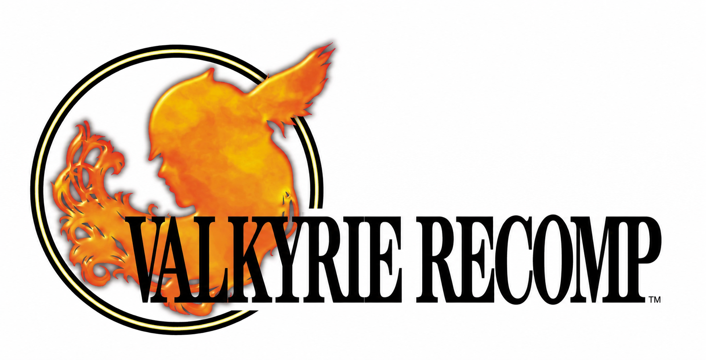
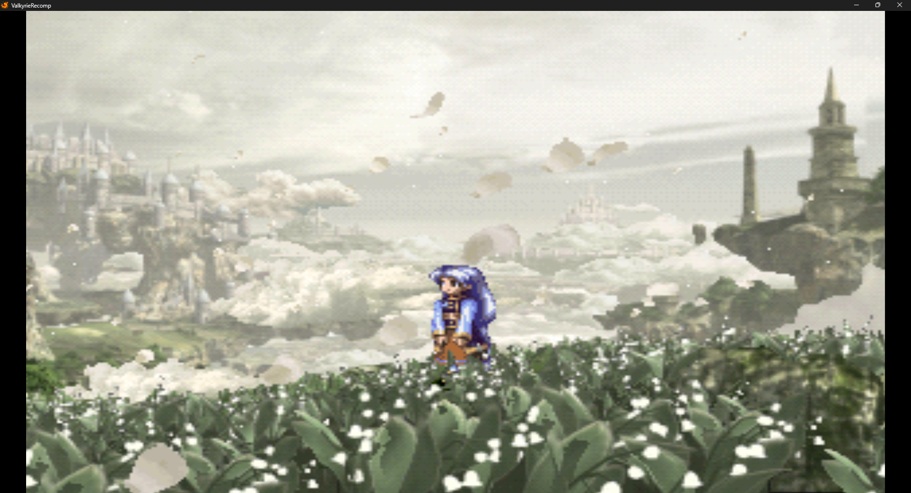

# ValkyrieRecomp (performance and reliability fork)

<p align="center">
  
</p>



A personal fork of **[ValkyrieRecomp](https://github.com/Ed1z19/ValkyrieRecomp)**
by **Ed1z19**, a native PC port of *Valkyrie Profile* (PlayStation, USA) built on
the **[PSXRecomp](https://github.com/mstan/psxrecomp)** framework and
**[recomp-ui](https://github.com/mstan/recomp-ui)** launcher by
**Matthew Stanley (mstan)**.

The original port, the recompiler and the launcher are their work. This fork,
made in October 2026 by **[hachi23](https://github.com/hachi23)**, focuses on
**performance, reliability and diagnostics**: measured frame-rate and memory
improvements, a graphics safety net, session logs and crash history, and a
repaired test suite. Full credits are in [CREDITS.md](CREDITS.md).

> **Status:** personal project, work in progress. No prebuilt releases are
> published from this fork. You need your own copy of the game to run it.

## What this fork changed

| Area | Before | After | How |
| --- | ---: | ---: | --- |
| World map frame rate | 27 fps | 51 fps | Interpreted overlay code now hands control to precompiled native code |
| Heavy cutscene (petal scene) | 32 fps | 56–60 fps | Consecutive see-through sprites share one GPU render pass |
| Movie decoding speed | 7.7 images/s | 11.4 images/s | Video-decoder memory transfers land in whole blocks, as DuckStation does |
| Full opening movie (wall time) | 163 s | 113 s | Same change; sampled frames pixel-identical |
| First field frame rate, dev build | 36 fps | 60 fps | Debug display recorder made opt-in (see note) |
| Peak memory, dev build | 590 MB | 528 MB | Same change |
| Runtime tests passing | 39 of 47 | 47 of 47 | Root causes fixed, one-command check script added |

Measured on the development laptop (Radeon RX 560X), mostly as medians of
alternating before/after runs. **Note:** the debug recorder only exists in builds with debug tools
switched on, which this fork uses for automated testing. Standard release
builds never paid that cost. Methods, raw numbers and limits are in
[docs/CHANGES.md](docs/CHANGES.md) and
[docs/PERFORMANCE_FINDINGS.md](docs/PERFORMANCE_FINDINGS.md).

Other additions:

- **Vulkan by default with a safety net.** The game tries Vulkan, then OpenGL,
  then software, and logs the reason for every step down. Verified by hiding
  the graphics driver from the game.
- **Session logs and crash history.** Each run writes a log; crashes are kept
  (last 20) with the settings and cheats that were active. The launcher
  notices an unexpected exit and offers Safe mode on the next start.
- **Cheat engine** (GameShark codes) with launcher editing, import and an
  in-game menu; RetroAchievements support; Smooth and De-dither texture
  filters; mid-session disc swap; Stretch to fill; launcher text scaling.
- **Linux build** alongside Windows.

## How it was built

This fork was built by directing AI coding agents through a written, phased
plan ([PLAN.md](PLAN.md), [docs/CLEANUP_PLAN.md](docs/CLEANUP_PLAN.md)).
I set the goals and acceptance rules, tested results in the game, and
approved each step. The agents wrote the code.

Rules every change had to pass:

- **Measure first.** Performance changes were profiled, then compared in
  alternating before/after runs with limits fixed in advance. One candidate
  sped up the first field by 39% but slowed the world map by 23%, so it was
  **rejected and reverted** (recorded in
  [PERFORMANCE_FINDINGS.md](docs/PERFORMANCE_FINDINGS.md)).
- **Prove the picture is unchanged.** Paired screenshots before and after;
  the software renderer is the correctness reference.
- **Test-gated.** `tools/dev/check.sh` builds the game and runs all tests
  before every commit.
- **Write it down.** Each step has a plain-language lesson in
  [LEARNING.md](LEARNING.md).

## Supported game

| | |
|---|---|
| Game | Valkyrie Profile |
| Region | USA / NTSC-U |
| Disc 1 serial | SLUS-01156 |
| Disc 2 serial | SLUS-01179 |
| Original publisher | Enix (2000) |

Discs are checked by fingerprint before code is generated. The expected file
names are listed under `discs` in [game.toml](game.toml).

## Building

This repository contains everything in one tree: the game configuration at
the root, the framework in `psxrecomp/` and the launcher in `recomp-ui/`.
There are no submodules.

```bash
git clone https://github.com/hachi23/ValkyrieRecomp-Complete.git
```

Put your own disc images in `disc/` (ignored by Git), then:

| Platform | Steps |
| --- | --- |
| Windows (MSYS2 MinGW64 + Vulkan SDK) | `tools/dev/gen.sh`, `tools/dev/bios.sh`, `tools/dev/build.sh` |
| Windows, before each commit | `tools/dev/check.sh` builds the game and runs every test |
| Linux | Generate the game code as on Windows (the output is the same), then `tools/dev/build_linux.sh` |

Each script is described in [tools/dev/README.md](tools/dev/README.md). The
Vulkan SDK must be installed, or the Vulkan renderer is left out of the build.
Framework build details: [psxrecomp/docs/BUILDING.md](psxrecomp/docs/BUILDING.md).

## Repository map

| Path | What it is |
| --- | --- |
| `game.toml`, `symbols.toml`, `seeds/`, `cheats/` | Game configuration (from the original ValkyrieRecomp) |
| `psxrecomp/` | Recompiler and runtime (PSXRecomp, with this fork's changes) |
| `recomp-ui/` | Launcher (recomp-ui, with this fork's changes) |
| `tools/dev/` | Build, test and capture scripts |
| `docs/CHANGES.md` | What this fork changed, with evidence |
| `docs/PERFORMANCE_FINDINGS.md` | Full performance investigation |
| `docs/CLEANUP_PLAN.md`, `PLAN.md` | Phase plans |
| `LEARNING.md` | Plain-language lessons written after each step |

## Legal

This repository **does not include game disc images, a Sony BIOS, saves or
generated game code**. You must supply your own legally obtained copy of the
game. *Valkyrie Profile* and its assets belong to their rights holders; no
ownership claim is made over them. The only BIOS used is OpenBIOS, a free
replacement.

`tools/dev/package_linux.sh` builds a play folder for personal use and copies
your own disc images into it. Never share its output.

## License

- `psxrecomp/`: PolyForm Noncommercial 1.0.0 ([psxrecomp/LICENSE](psxrecomp/LICENSE)).
  Non-commercial use only.
- `recomp-ui/`: MIT ([recomp-ui/LICENSE](recomp-ui/LICENSE)).
- Bundled libraries: see [psxrecomp/THIRD_PARTY_ATTRIBUTION.md](psxrecomp/THIRD_PARTY_ATTRIBUTION.md).
- The original ValkyrieRecomp game configuration did not state a license; it
  is used here with credit to its author.
